<div align="center">

# Reflex

### Agentify the web you already use.

**A compatibility layer for the agentic web.** Reflex reads a website's forms, buttons and
accessibility metadata, proposes WebMCP tools from what it finds, and — once a human approves them —
registers those tools so an agent can drive the site through a structured interface instead of by
clicking pixels.

[](LICENSE)
[](apps/extension/public/manifest.json)
[](tsconfig.base.json)
[](#testing)
[](#webmcp-hosts)

[**Download the extension**](https://github.com/biratdatta/reflex/releases/latest) ·
[**Watch the 47s demo**](docs/reflex-demo-narrated.mp4) ·
[Quick start](#quick-start) ·
[How it works](#how-it-works) ·
[On real websites](#on-real-websites) ·
[Safety](#safety-and-privacy)


</div>

---

## The 47-second version

[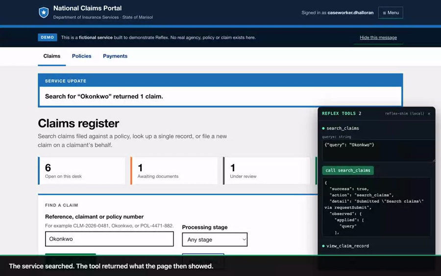](docs/reflex-demo-narrated.mp4)

**[▶ Watch the demo](docs/reflex-demo-narrated.mp4)** — 47 seconds, narrated, recorded from the built
extension against the running demo service. Prefer it quiet? The same cut without the voiceover is
[**here**](docs/reflex-demo-silent.mp4) — the on-screen captions carry the commentary either way.
Both are attached to [the release](https://github.com/biratdatta/reflex/releases/latest), in MP4 and
WebM.

A government claims service with no WebMCP and no agent hooks. Reflex reads it, proposes tools, a
human approves two, an agent calls `search_claims({"query": "Okonkwo"})` — and the service's own form
is filled and submitted, not bypassed. Then a destructive tool is called, and Chrome asks a human
first.

The voiceover is macOS text-to-speech and the three interface cues are synthesised tones, so nothing
in the soundtrack needs a licence.

---

## The idea

Most websites were built before WebMCP existed. Adapting each one by hand means a developer
identifying capabilities, naming tools, writing descriptions, authoring JSON Schemas, implementing
handlers and maintaining registrations — which is exactly the adoption barrier that keeps agents
stuck driving user interfaces visually: fragile, slow, and ambiguous.

But those websites are not silent about what they do. They already describe much of their
functionality — through forms, semantic HTML and the accessibility metadata they were required to
add anyway.

> **Reflex treats accessibility metadata as evidence for a capability contract.**
> Existing websites contain enough semantic information to bootstrap an agent interface. Reflex
> turns that implicit interface into an explicit WebMCP one.

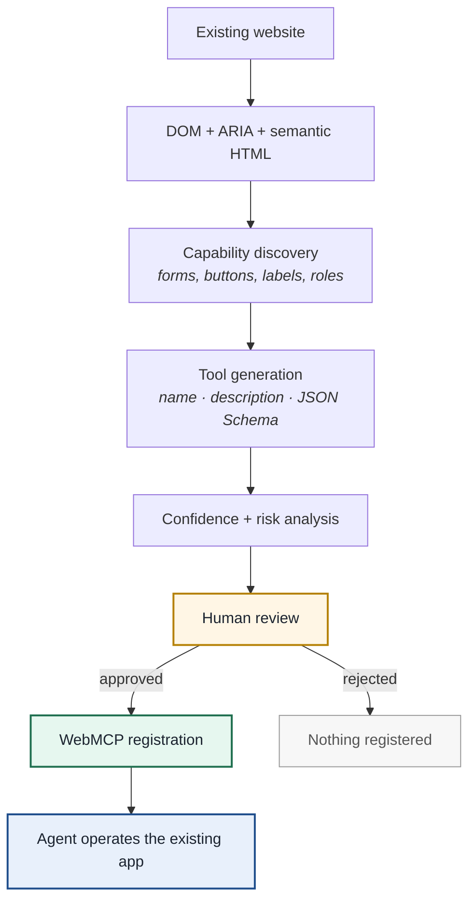

Human review is not a setting to switch off. It is the product: generated tools can be wrong, and
the person approving one gets to see exactly which markup produced it.

### What that looks like

A form the service already had:

```html
<form aria-label="Search claims"
      aria-description="Find a claim by reference number, claimant name or policy number">
  <label for="claim-query">Reference, claimant or policy number</label>
  <span class="hint" id="claim-query-hint">For example CLM-2026-0481, Okonkwo, or POL-4471-882.</span>
  <input id="claim-query" name="query" type="text" required maxlength="60"
         aria-describedby="claim-query-hint" />
  <button type="submit">Search claims</button>
</form>
```

The tool Reflex proposes from it — name, description, schema and the field's own
hint, all lifted from markup that was already there:

```json
{
  "name": "search_claims",
  "title": "Search claims",
  "description": "Find a claim by reference number, claimant name or policy number.",
  "inputSchema": {
    "type": "object",
    "properties": {
      "query": {
        "type": "string",
        "maxLength": 60,
        "description": "For example CLM-2026-0481, Okonkwo, or POL-4471-882."
      }
    },
    "required": ["query"],
    "additionalProperties": false
  },
  "risk": "read",
  "confidence": 100
}
```

Calling it sets the field, dispatches `input` and `change`, calls `form.requestSubmit()`, and returns
the text of the region the form updates — so a read-only tool returns **data**, not just
"submitted".

---

## Quick start

### 1. Install the extension

**Download:** [latest release](https://github.com/biratdatta/reflex/releases/latest) — or
[`release/reflex-extension-0.3.0.zip`](release/reflex-extension-0.3.0.zip) from the tree (76 KB)

Unzip it, then:

1. Open `chrome://extensions`
2. Turn on **Developer mode** (top right)
3. Click **Load unpacked** and select the unzipped **`reflex-extension`** folder
4. Pin Reflex to the toolbar (puzzle-piece icon → pin)

<details>
<summary><b>Or build it from source</b></summary>

```bash
npm install
npm run build:extension     # → apps/extension/dist  (load this folder unpacked)
npm run package             # → release/reflex-extension-<version>.zip
```

</details>

### 2. Run the demo application

```bash
npm run dev:demo            # → http://localhost:3000/claims
```

**National Claims Portal** is a fictional government insurance service included in this repo — the
Department of Insurance Services for the (entirely invented) State of Marisol. Public-sector services
are the right subject for this: they are form-heavy, they are the software people are actually forced
to use, and their accessibility metadata is genuinely excellent because it had to be.

It uses nothing but standard HTML and good ARIA — no Reflex-specific hooks — and it deliberately
plants decoys ("Toggle navigation menu", "Dismiss this notice", "Print this page", "Next page",
"Expand all rows") that must *not* become tools.

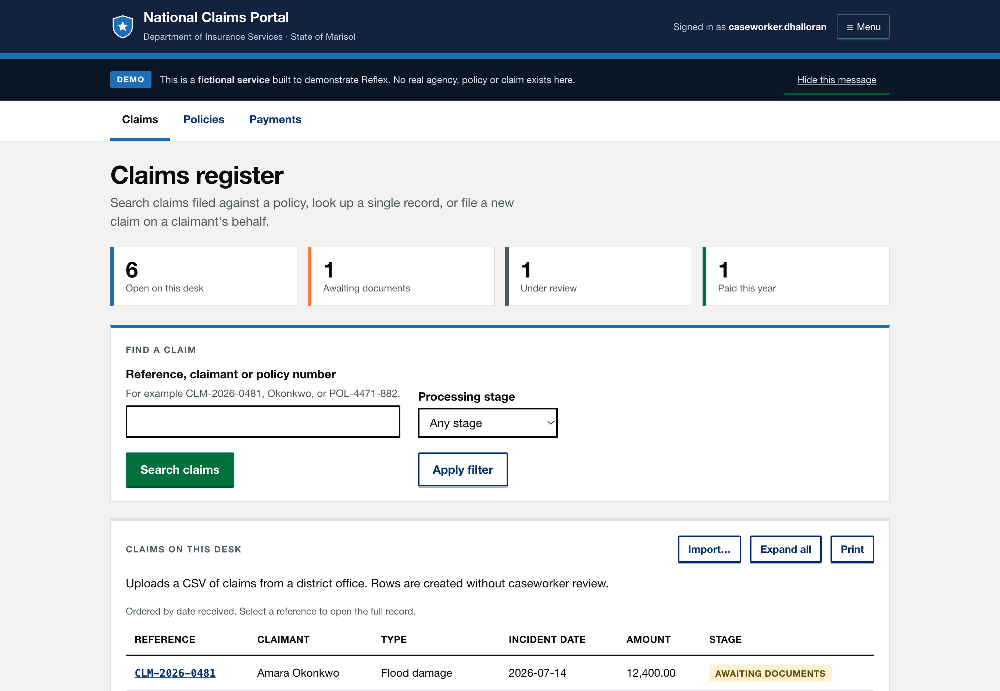

### 3. Discover, review, approve

Open the app and click the Reflex button.

<table>
<tr>
<td width="33%" valign="top">

<b>Discover</b><br/>
An agent-readiness score in plain words, and how many of the page's candidates are actually worth a
decision.
</td>
<td width="33%" valign="top">
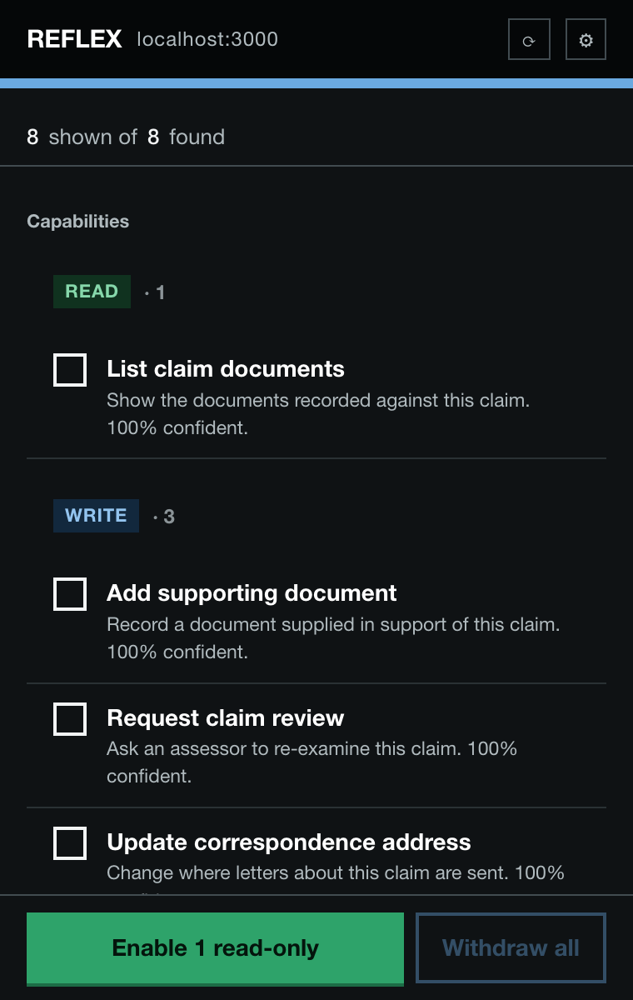
<b>Review</b><br/>
Capabilities grouped read → write → sensitive → destructive, each described in the page's own words.
Light and dark, following your system.
</td>
<td width="33%" valign="top">

<b>Inspect</b><br/>
The generated name, description, schema and — crucially — the <b>evidence</b>: the exact ARIA
attributes and labels that produced it. Correct anything that reads wrong.
</td>
</tr>
</table>

### 4. Let an agent use it

A **REFLEX TOOLS** panel appears in the page. It stands in for a WebMCP client — no shipping browser
exposes WebMCP yet — listing exactly what was registered and calling it with JSON arguments. Or drive
it from the page's DevTools console, the way a real client would:

```js
navigator.modelContext.listTools().map((tool) => tool.name);
// → ['search_claims', 'request_claim_review']

await navigator.modelContext.callTool('search_claims', { query: 'Okonkwo' });
// → { success: true,
//     observed: { region: 'CLM-2026-0481  Amara Okonkwo  Flood damage  12,400.00  AWAITING DOCUMENTS' } }
```

---

## The demo walkthrough

On [`/claims/CLM-2026-0481`](http://localhost:3000/claims/CLM-2026-0481) — a flood-damage claim
awaiting documents — Reflex finds eight capabilities spanning all four risk levels:

| Capability | Risk | Conf. | Behaviour |
| --- | --- | --- | --- |
| `list_claim_documents` | `read` | 100% | Lists documents on file, and returns the table's contents |
| `add_supporting_document` | `write` | 100% | Records a document — the file input is skipped, since an agent cannot supply one |
| `request_claim_review` | `write` | 100% | Sends the claim back to an assessor |
| `update_correspondence_address` | `write` | 100% | Changes where letters go |
| `authorise_payment` | `sensitive` | 100% | Releases money — the *act* is consequential |
| `set_claim_access_pin` | `sensitive` | 55% | Schema is **empty**: its only field is a password input |
| `delete_supporting_document` | `destructive` | 100% | Removes a document — **asks you first, in the page** |
| `withdraw_claim` | `destructive` | 75% | Closes the case permanently — **asks you first** |

Four things worth trying:

1. **A read tool that returns real data.** Enable `list_claim_documents` and call it with
   `{"verification": "verified"}`. The table filters, and the tool returns what the page then showed —
   not a bare "submitted".

2. **A write tool moving the case along.** Enable `request_claim_review` and call it with
   `{"reason": "valuation-dispute"}`. The claim's stage becomes *Under review* and the case history
   gains an entry, because the service's own form was driven rather than bypassed.

3. **Human approval on a destructive call.** Enable `withdraw_claim` and call it. Chrome asks you, in
   the page, every time. Dismiss it and nothing happens; accept and the claim closes.

4. **Break the fingerprint.** With `request_claim_review` enabled, run this in the page console and
   call the tool again:

   ```js
   document.getElementById('request-review').setAttribute('aria-label', 'Reject claim outright');
   ```

   It refuses: `accessible name changed from "Request claim review" to "Reject claim outright"`. The
   selector still matched. The meaning didn't.

The register at [`/claims`](http://localhost:3000/claims) is where the schema generation shows off —
`file_new_claim` yields nine parameters from one form, including a policy-number `pattern`, a
`claimType` enum, a `date`, a `number` bounded 100–500,000, a radio group and a checkbox. And
[`/policies`](http://localhost:3000/policies) demonstrates the classification split: `check_policy_status`
is a `read`, `renew_policy` a `write`, `cancel_policy` `destructive`.

## Review, not just discovery

Discovery is the easy half. On one YouTube watch page Reflex finds **57 candidates, every one scoring
55%**, named `1_reply`, `150_replies`, `166_replies` — the "N replies" button on every comment. A list
that long is not a review queue, it is a wall, and a wall is worth exactly as much as an empty panel.

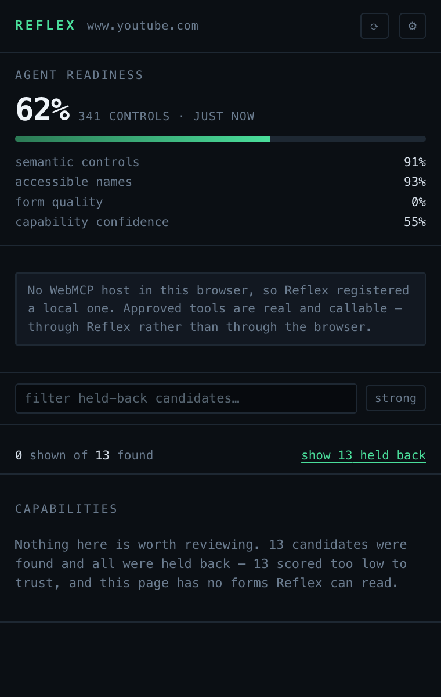

So every scan is triaged before it reaches you:

**Two floors, not one.** A flat confidence floor is the wrong instrument, because real working
capabilities on well-built government forms *also* score 50–60% — Companies House's
`search_the_register` and the NHS pharmacy finder both do, having never written an
`aria-description`. What separates them from the noise is the **source**: a form arrives with a typed
schema, which is evidence in itself and something a reviewer can judge; a button is an
unparameterised action inferred from two words of label, so it needs corroboration. Forms are held to
**50%**, buttons to **70%**.

**Counts are not capabilities.** A label beginning with a number — "1 reply", "349 languages" — was a
tally, not an action. Those are held back on sight.

**Indistinguishable duplicates collapse.** `show_cards`, `show_cards_2` and `show_cards_3` become one
row carrying `×3`, because the page gave no way to tell them apart, and an agent could not choose
between them either.

**Nothing is discarded.** Everything held back stays one click away behind *show N held back*, each
row explaining why it was held, and any of them can still be enabled.

**A score explains itself.** `55%` tells a reviewer nothing on its own, so the inspector lists what
the page failed to declare: *no ARIA description*, *no field labels*, *declares fields but exposes
none*.

The result on the page above: **0 shown of 13 found** — and a sentence saying why, instead of
thirteen rows of noise. On the demo service it is 8 of 8, because that service actually declares what
it does.

<br clear="all">

---

## On real websites

Reflex is not demo-ware. Measured with `npm run scan -- <url>`, which runs the real discovery engine
against a live page:

| Site | Readiness | Discovered |
| --- | --- | --- |
| [GOV.UK search](https://www.gov.uk/search/all) | **95%** | `site_wide(keywords)` + a **10-parameter** filter form |
| [NHS pharmacy finder](https://www.nhs.uk/service-search/pharmacy/find-a-pharmacy) | **90%** | `find_a_pharmacy(Location)` |
| [Companies House](https://find-and-update.company-information.service.gov.uk/) | **89%** | `search_the_register(q)` |
| [Wikipedia](https://en.wikipedia.org/wiki/Main_Page) | 82% | `searchform(search)` — named from an `id`, so worth renaming |
| [GitHub advanced search](https://github.com/search/advanced) | 72% | one form → **25 parameters** (`search_stars`, `search_license`, `search_author`, …) |
| [Hacker News](https://news.ycombinator.com/) | 50% | nothing — forms without accessible names |
| [OrangeHRM demo](https://opensource-demo.orangehrmlive.com/) | 39% | nothing — placeholder-only labels |

The top three were verified end to end: approve the tool, call it through `navigator.modelContext`,
and the site performs the real search. Their Content-Security-Policy is no obstacle, because Chrome
injects the runtime through a privileged path rather than a `<script>` tag.

The low scores are the honest half of the story, and they are what the readiness breakdown is for: it
names *which* signal is missing — accessible names, form quality — instead of just reporting that a
page did not work.

```bash
npm run scan -- https://www.gov.uk/search/all          # read-only: discovers, never calls
npm run scan -- --threshold 40 --json https://example.com
```

---

## The panel

The default design is **Civic** — the language of public-service software: plain words lead, the tool
name recedes, risk is a solid tag rather than a coloured dot, and the type is heavy enough that
approving something feels like a decision. That suits what the panel actually is: the thing standing
between an agent and your account. It ships in **light and dark**, following your system unless you
choose.

Four other designs are built in, because which one is right depends on who is reviewing — a developer
auditing their own app wants density; someone deciding whether an agent may move money wants gravity.
Switch in Settings.

<table>
<tr>
<td width="20%">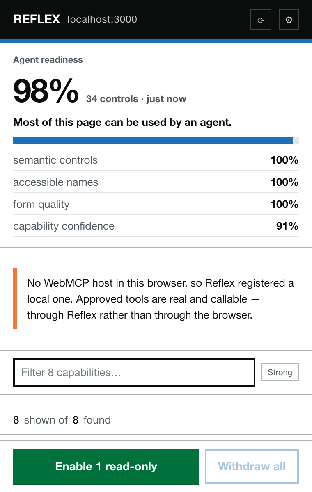<b>Civic</b><br/><sub>Default. Plain words, heavy type, solid tags. Light and dark.</sub></td>
<td width="20%">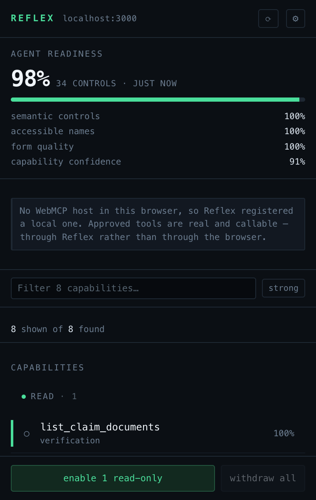<b>Instrument</b><br/><sub>A telemetry readout. Densest; monospace names diff at a glance.</sub></td>
<td width="20%">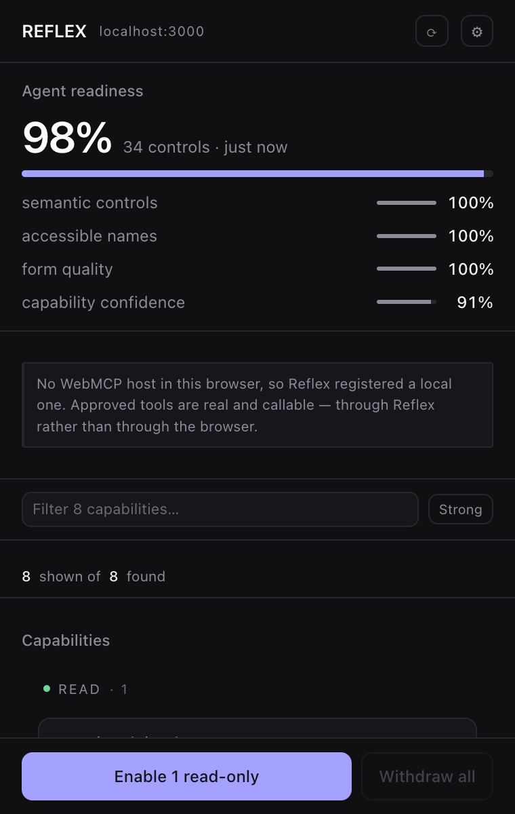<b>Quiet Product</b><br/><sub>Restrained modern software. Soft cards, one muted accent.</sub></td>
<td width="20%">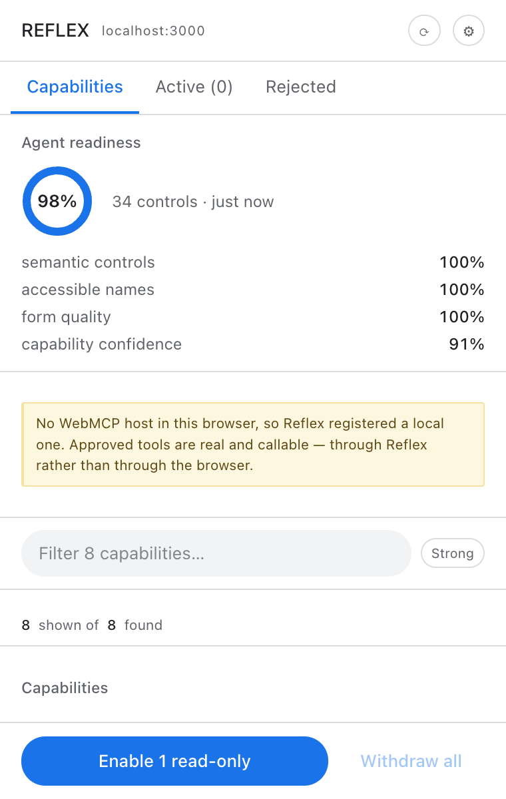<b>Native Chrome</b><br/><sub>The browser's own surfaces. Tabs, ring gauge, system type.</sub></td>
<td width="20%">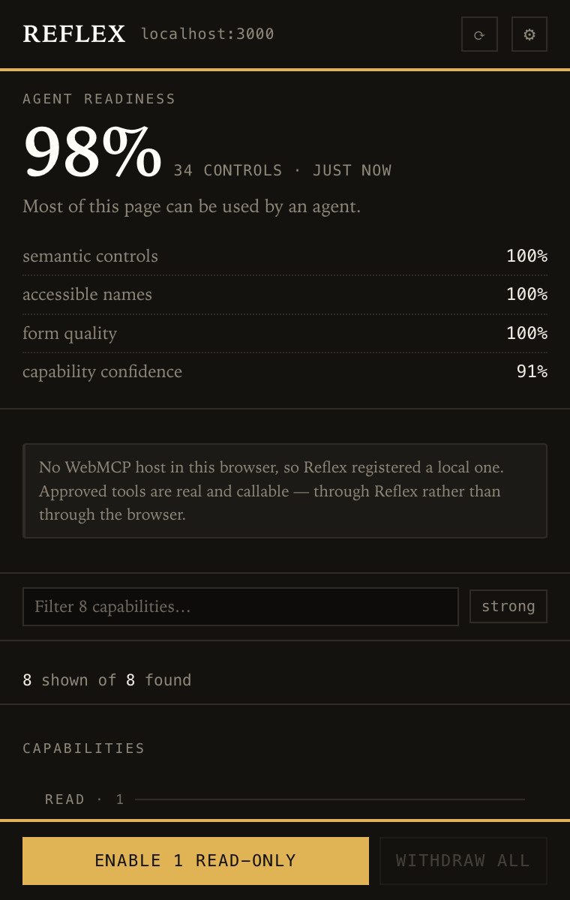<b>Ledger</b><br/><sub>An audit sheet. Brass on warm black, display numerals.</sub></td>
</tr>
</table>

All five share one component tree and one set of decisions: every row renders each design's parts — a
mono tool name, a human title, a plain-language sentence, a stripe, a tick — and the stylesheet
decides which are visible. The triage and approval logic cannot drift between designs, and an
end-to-end test asserts each one still renders the same eight capabilities and still registers a tool.

### Settings

| Setting | Default | What it controls |
| --- | --- | --- |
| Panel design | Civic | Which of the five looks the panel wears |
| Light / dark | System | Civic's two modes; the other four are single-look by design |
| Reflex enabled here | On | Per origin. Turning it off withdraws every registered tool at once |
| Confirm destructive calls | On | Asks in the page before a destructive tool actuates, every time |
| Rescan when the page changes | On | Keeps the list in step with what is on screen |
| Minimum confidence | 50% | The floor before triage, which then judges forms at 50% and buttons at 70% |
| Provide a local WebMCP host | On | Registers tools even where the browser exposes no host |
| Show the in-page tool console | On | The stand-in WebMCP client used for demos |

---

## How it works

### Two JavaScript worlds

A Chrome content script cannot reach the page's own JavaScript, and `navigator.modelContext` lives
there. So Reflex is split, with a strict message protocol between the halves:

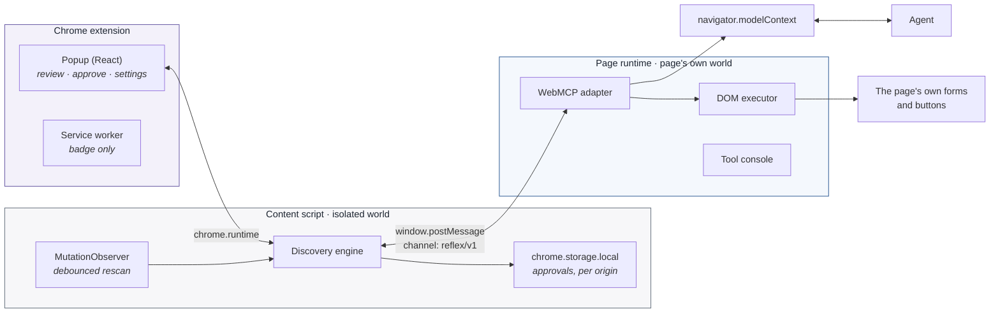

The content script decides **what exists** and holds the user's decisions. The page runtime decides
**nothing** — it registers what it is told to and executes it. Neither half can do the other's job,
which is what keeps `modelContext` access out of the extension and DOM policy out of the page.

### From approval to actuation

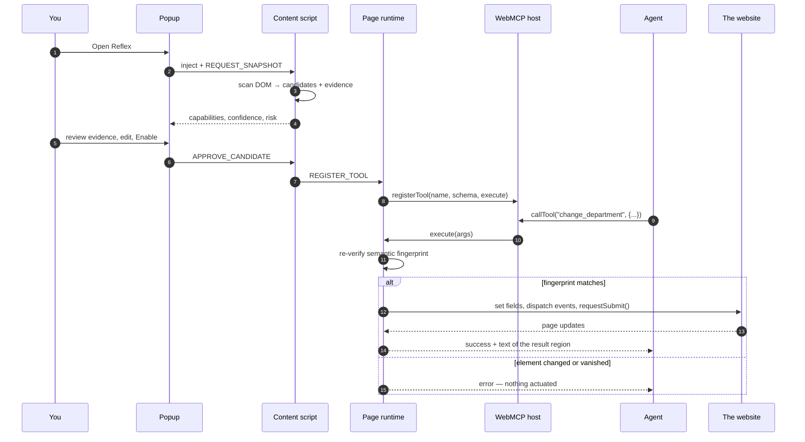

### What gets read, and what it becomes

| Signal in the page | What Reflex derives |
| --- | --- |
| `aria-label`, `aria-labelledby` | tool name and title |
| `aria-description`, `aria-describedby` | tool description |
| `<label for>`, wrapping `<label>` | parameter descriptions |
| `<legend>`, adjacent headings | fallback names for forms |
| `type`, `required`, `min`/`max`, `pattern`, `<option>` | JSON Schema, enums, constraints |
| `aria-controls`, live regions, `role="status"` | what the tool returns to the agent |
| the verbs in those labels | risk classification |

Names resolve in a fixed priority — `aria-label` → `aria-labelledby` → heading/legend → visible text
→ `name` → `id` — and **every candidate carries the evidence that produced it**, so a reviewer can
see why Reflex proposed something instead of taking its word.

Generic interface mechanics never become tools. "Close", "Toggle sidebar", "Next page", "Move tools
to sidebar" are dropped by rules calibrated against real pages — an agent should invoke a business
capability, not operate incidental UI.

<details>
<summary><b>HTML → JSON Schema mapping</b></summary>

| HTML | JSON Schema |
| --- | --- |
| `text`, `search`, `tel`, `<textarea>` | `string` (+ `minLength`, `maxLength`, `pattern`) |
| `email` | `string`, `format: email` |
| `url` | `string`, `format: uri` |
| `number`, `range` | `number` (+ `minimum`, `maximum`); `integer` when `step` is whole |
| `date` / `time` / `datetime-local` | `string` + `format: date` / `time` / no format |
| `checkbox` (single) | `boolean` |
| `checkbox` (shared name) | `array` of `enum` |
| `radio` group | `string` with `enum` of the group's values |
| `<select>` | `string` with `enum`; `array` when `multiple` |
| `required` | added to the schema's `required` list |
| `password` | **never exposed**; escalates the tool's risk to `sensitive` |
| `hidden`, `file`, `submit`, `disabled`, unnamed | skipped — no agent-settable value |

</details>

### Confidence

An additive heuristic over the signals above, capped at 100:

| Signal | Points |
| --- | --- |
| `aria-label` present | +30 |
| `aria-description` present | +20 |
| every field has an authored label | +15 |
| a real `<form>` element | +15 |
| every field has a `name` | +10 |
| explicit button text | +10 |
| field-level help text | +10 |
| declares fields but exposes none | −20 |

`90–100` high · `75–89` review recommended · `50–74` low · **below 50 is not shown at all**
(adjustable in settings).

In practice, on the demo service: `search_claims` scores 100 (ARIA label, ARIA description, labelled
and named field, real form, submit button, field hint), `withdraw_claim` 75 (a button, so no fields
to score), and `set_claim_access_pin` 55 — it declares a field but exposes none, because that field
is a password.

### Risk

Keyword rules, checked most-dangerous-first, so "Search and revoke access" is `destructive` rather
than `read`. Unknown verbs default to `write`.

| Level | Decided by | Consequence |
| --- | --- | --- |
| `read` | a leading read verb — search, view, list, filter, check | the only level eligible for bulk approval |
| `write` | a leading write verb — create, add, update, file, request, renew | individual approval |
| `sensitive` | a **consequential action** (authorise, approve, send, reset, grant), or a write against a **sensitive subject** (password, bank, payment, role, access) | individual approval |
| `destructive` | delete, remove, revoke, withdraw, cancel, terminate, archive | individual approval **and** a confirmation in the page on every call |

Two refinements matter here, both forced out by real markup:

**Sensitive actions are distinguished from sensitive subjects.** `authorise_payment` moves money, so
it is sensitive. `search_payments` only looks, so it is a `read` — flagging it would be the kind of
warning people learn to click past.

**The leading verb wins.** "View claim record" is a `read` even though *record* is also a write verb,
and "List documents recorded against this claim" is a `read` despite *recorded* in its description.

Risk is advisory and editable in the inspector — the keyword that decided it is shown, so a
misclassification is visible rather than mysterious.

### Failing closed

Every candidate stores a stable selector **and** a semantic fingerprint: tag, role, accessible name,
and the field names it expects. Before actuating anything, Reflex re-locates the element and
re-checks that fingerprint. A form that lost a field, or a button whose accessible name changed,
produces an error — never a click on whatever now occupies that selector.

Values are set through native property setters followed by `input` and `change` events, so
frameworks notice the change; submission prefers `form.requestSubmit()` so the page's own validation
and handlers run. On multi-page apps, execution detects the page starting to navigate and returns
promptly with `observed.navigating: true` instead of waiting for a result it could never read.

---

## Repository layout

```
reflex/
├── apps/
│   ├── extension/              Chrome extension (Manifest V3)
│   │   └── src/
│   │       ├── content/        discovery, decisions, storage, the bridge
│   │       ├── page/           WebMCP registration, DOM execution, tool console
│   │       ├── popup/          React review UI
│   │       ├── background/     badge only
│   │       └── shared/         messaging, storage, settings
│   └── demo-legacy-app/        National Claims Portal (the fictional service)
├── packages/
│   ├── capability-model/       CapabilityCandidate, schema + message types
│   ├── discovery-engine/       scanners, ARIA/labels, naming, risk, confidence,
│   │                           selectors + fingerprints, readiness
│   ├── schema-generator/       HTML form controls → JSON Schema
│   └── webmcp-adapter/         the only code touching modelContext, + executor
├── tools/
│   ├── scan-site.mjs           run the engine against any live URL (read-only)
│   └── package-extension.mjs   build the loadable zip
├── release/                    the packaged extension
├── docs/screenshots/
└── tests/
    ├── unit/                   Vitest (jsdom)
    └── e2e/                    Playwright, against the real built extension
```

The discovery engine has no extension dependencies, so it can be reused outside Reflex — which is
what `npm run scan` does.

### Commands

| Command | What it does |
| --- | --- |
| `npm run build:extension` | Build into `apps/extension/dist` (load this unpacked) |
| `npm run package` | Build and zip into `release/` |
| `npm run dev:demo` | Serve the demo app on port 3000 |
| `npm run scan -- <url>` | Point the discovery engine at any live page |
| `npm test` | 181 unit tests (jsdom) |
| `npm run test:e2e` | 22 end-to-end tests in a real browser |
| `npm run typecheck` | Typecheck every workspace |

---

## Safety and privacy

- **Nothing registers itself.** Every tool requires an explicit human approval. "Enable read-only
  tools" is the only bulk action, and it touches nothing above `read`.
- **Approvals are scoped by origin**, in `chrome.storage.local`. A tool approved on one site never
  appears on another — including the same application served from a different host.
- **Destructive calls ask again, in the page,** every single time an agent invokes them.
- **Password fields are never exposed.** A form containing one has that field omitted from the schema
  and its risk escalated to `sensitive`.
- **Targets are re-verified before execution**, and execution fails closed when the element's meaning
  has changed.
- **Discovery is local.** No page content, DOM, form values or account data leaves the browser.
  Reflex has no backend, and the MVP uses no model at all — discovery is deterministic rules over
  markup.
- **Minimal permissions:** `activeTab`, `scripting`, `storage`. No host permissions, so Reflex reads
  a page only when you open it there.
- **One switch off.** Disabling Reflex for a site withdraws every registered tool immediately.

---

## WebMCP hosts

WebMCP is experimental and not in stable Chrome. `packages/webmcp-adapter` is the only place that
knows this:

1. probe `navigator.modelContext`, then `document.modelContext`
2. support both `registerTool` and `provideContext` host styles
3. failing both, install a **local host marked `__reflexShim: true`** so approved tools are still real
   and callable

The popup always states which of those is in play. When a browser ships a native host, the adapter
uses it and nothing else in the codebase changes.

---

## Testing

```bash
npm test          # 181 unit tests (jsdom)
npm run test:e2e  # 22 tests in a real browser, against the built extension
```

Unit tests cover naming, ARIA and label resolution, the full HTML → JSON Schema mapping, ignore rules
(including real labels harvested from live sites), risk classification, selector and fingerprint
generation, the adapter against three host styles, DOM execution — and discovery run over the demo
service's **own rendered markup**, so a regression in its accessibility is a test failure. Those
tests also assert the classification split directly: `search_payments` must stay `read` while
`authorise_payment` must be `sensitive`.

End-to-end tests need Playwright's Chromium once:

```bash
npx playwright install chromium
```

Stable Chrome no longer honours `--load-extension`, so the suite uses Chromium
(`REFLEX_E2E_EXECUTABLE=/path/to/Chromium` points it at a build you already have). It stages the
built extension with one change — a host permission for `localhost:3000`, standing in for the click
that would otherwise grant `activeTab` — then injects Reflex exactly as the popup does, drives the
real popup UI, and calls the registered tools the way a WebMCP client would.

---

## License

[MIT](LICENSE) © 2026 Birat Datta
