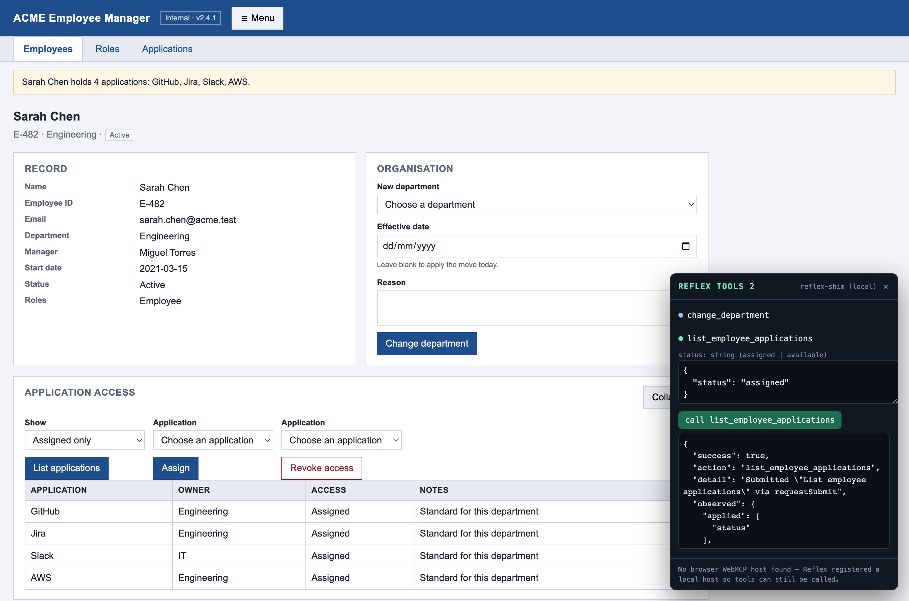
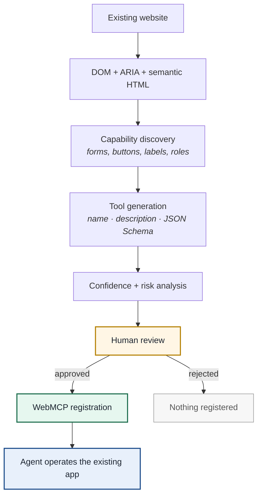
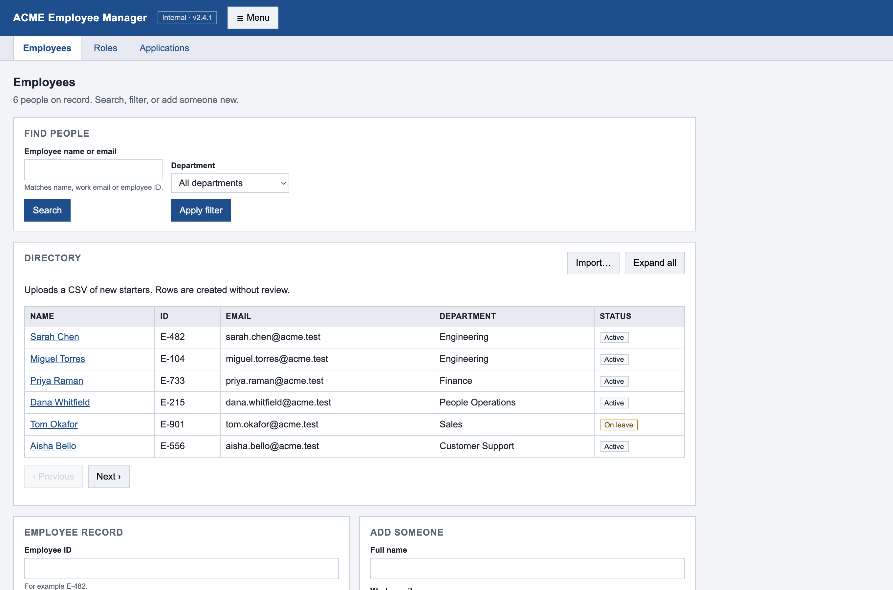
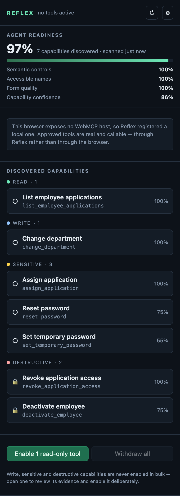
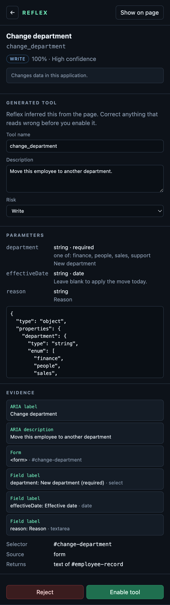
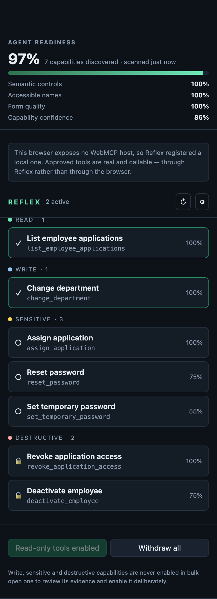
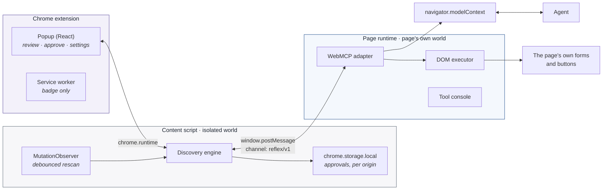
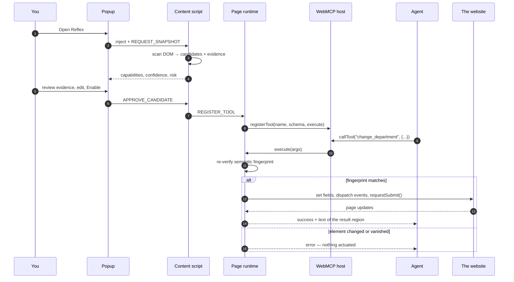

<div align="center">

# Reflex

### Agentify the web you already use.

**A compatibility layer for the agentic web.** Reflex reads a website's forms, buttons and
accessibility metadata, proposes WebMCP tools from what it finds, and — once a human approves them —
registers those tools so an agent can drive the site through a structured interface instead of by
clicking pixels.

[](LICENSE)
[](apps/extension/public/manifest.json)
[](tsconfig.base.json)
[](#testing)
[](#webmcp-hosts)

[**Download the extension**](release/reflex-extension-0.1.0.zip) ·
[Quick start](#quick-start) ·
[How it works](#how-it-works) ·
[On real websites](#on-real-websites) ·
[Safety](#safety-and-privacy)



</div>

---

## The idea

Most websites were built before WebMCP existed. Adapting each one by hand means a developer
identifying capabilities, naming tools, writing descriptions, authoring JSON Schemas, implementing
handlers and maintaining registrations — which is exactly the adoption barrier that keeps agents
stuck driving user interfaces visually: fragile, slow, and ambiguous.

But those websites are not silent about what they do. They already describe much of their
functionality — through forms, semantic HTML and the accessibility metadata they were required to
add anyway.

> **Reflex treats accessibility metadata as evidence for a capability contract.**
> Existing websites contain enough semantic information to bootstrap an agent interface. Reflex
> turns that implicit interface into an explicit WebMCP one.



Human review is not a setting to switch off. It is the product: generated tools can be wrong, and
the person approving one gets to see exactly which markup produced it.

### What that looks like

A form the site already had:

```html
<form aria-label="Search employees" aria-description="Find an employee by name or email">
  <label for="employee-query">Employee name or email</label>
  <input id="employee-query" name="query" type="text" required />
  <button type="submit">Search</button>
</form>
```

The tool Reflex proposes from it:

```json
{
  "name": "search_employees",
  "title": "Search employees",
  "description": "Find an employee by name or email.",
  "inputSchema": {
    "type": "object",
    "properties": { "query": { "type": "string", "description": "Employee name or email" } },
    "required": ["query"],
    "additionalProperties": false
  },
  "risk": "read",
  "confidence": 100
}
```

Calling it sets the field, dispatches `input` and `change`, calls `form.requestSubmit()`, and returns
the text of the region the form updates — so a read-only tool returns **data**, not just
"submitted".

---

## Quick start

### 1. Install the extension

**Download:** [`release/reflex-extension-0.1.0.zip`](release/reflex-extension-0.1.0.zip) (69 KB)

Unzip it, then:

1. Open `chrome://extensions`
2. Turn on **Developer mode** (top right)
3. Click **Load unpacked** and select the unzipped **`reflex-extension`** folder
4. Pin Reflex to the toolbar (puzzle-piece icon → pin)

<details>
<summary><b>Or build it from source</b></summary>

```bash
npm install
npm run build:extension     # → apps/extension/dist  (load this folder unpacked)
npm run package             # → release/reflex-extension-<version>.zip
```

</details>

### 2. Run the demo application

```bash
npm run dev:demo            # → http://localhost:3000/employees
```

**ACME Employee Manager** is a fictional legacy HR app included in this repo. It uses nothing but
standard HTML and good accessibility metadata — no Reflex-specific hooks — and it deliberately
includes decoys ("Toggle navigation menu", "Next page", "Collapse this section") that must *not*
become tools.



### 3. Discover, review, approve

Open the app and click the Reflex button.

<table>
<tr>
<td width="33%" valign="top">

<b>Discover</b><br/>
An agent-readiness score, and every capability found on the page, grouped read → write → sensitive →
destructive. Destructive ones are marked 🔒.
</td>
<td width="33%" valign="top">

<b>Inspect</b><br/>
The generated name, description, schema and — crucially — the <b>evidence</b>: the exact ARIA
attributes, form and field labels that produced it. Correct anything that reads wrong.
</td>
<td width="33%" valign="top">

<b>Agentify</b><br/>
Approve, and the tool is registered with the page's WebMCP host. The toolbar badge counts what is
live.
</td>
</tr>
</table>

### 4. Let an agent use it

A **REFLEX TOOLS** panel appears in the page. It stands in for a WebMCP client — no shipping browser
exposes WebMCP yet — listing exactly what was registered and calling it with JSON arguments. Or drive
it from the page's DevTools console, the way a real client would:

```js
navigator.modelContext.listTools().map((tool) => tool.name);
// → ['search_employees', 'change_department']

await navigator.modelContext.callTool('search_employees', { query: 'Sarah Chen' });
// → { success: true, observed: { region: 'Sarah Chen  E-482  sarah.chen@acme.test  Engineering …' } }
```

---

## The demo walkthrough

On [`/employees/E-482`](http://localhost:3000/employees/E-482) (Sarah Chen), Reflex finds seven
capabilities across all four risk levels:

| Capability | Risk | Behaviour |
| --- | --- | --- |
| `list_employee_applications` | `read` | Lists what she can access, and returns the table's contents |
| `change_department` | `write` | Moves her to another department — enum of real options |
| `assign_application` | `sensitive` | Grants an application (its description mentions *access*) |
| `reset_password` | `sensitive` | Emails a reset link |
| `revoke_application_access` | `destructive` | Removes access — **asks you first, in the page** |
| `deactivate_employee` | `destructive` | Blocks sign-in — **asks you first, in the page** |
| `set_temporary_password` | `sensitive` | Schema is **empty**: its only field is a password input |

Three things worth trying:

1. **Enable `change_department`** and call it with `{"department": "finance"}`. The record, the status
   banner and the department all update — because the app's own form was driven, not bypassed.
2. **Enable `revoke_application_access`** and call it. Chrome asks for approval *in the page*.
   Dismiss it and nothing happens; accept and AWS access is gone.
3. **Break the fingerprint.** With `change_department` enabled, run this in the page console and call
   the tool again:

   ```js
   document.getElementById('change-department').setAttribute('aria-label', 'Terminate employment');
   ```

   It refuses: `accessible name changed from "Change department" to "Terminate employment"`. The
   selector still matched. The meaning didn't.

---

## On real websites

Reflex is not demo-ware. Measured with `npm run scan -- <url>`, which runs the real discovery engine
against a live page:

| Site | Readiness | Discovered |
| --- | --- | --- |
| [GOV.UK search](https://www.gov.uk/search/all) | **95%** | `site_wide(keywords)` + a **10-parameter** filter form |
| [NHS pharmacy finder](https://www.nhs.uk/service-search/pharmacy/find-a-pharmacy) | **90%** | `find_a_pharmacy(Location)` |
| [Companies House](https://find-and-update.company-information.service.gov.uk/) | **89%** | `search_the_register(q)` |
| [Wikipedia](https://en.wikipedia.org/wiki/Main_Page) | 82% | `searchform(search)` — named from an `id`, so worth renaming |
| [GitHub advanced search](https://github.com/search/advanced) | 72% | one form → **25 parameters** (`search_stars`, `search_license`, `search_author`, …) |
| [Hacker News](https://news.ycombinator.com/) | 50% | nothing — forms without accessible names |
| [OrangeHRM demo](https://opensource-demo.orangehrmlive.com/) | 39% | nothing — placeholder-only labels |

The top three were verified end to end: approve the tool, call it through `navigator.modelContext`,
and the site performs the real search. Their Content-Security-Policy is no obstacle, because Chrome
injects the runtime through a privileged path rather than a `<script>` tag.

The low scores are the honest half of the story, and they are what the readiness breakdown is for: it
names *which* signal is missing — accessible names, form quality — instead of just reporting that a
page did not work.

```bash
npm run scan -- https://www.gov.uk/search/all          # read-only: discovers, never calls
npm run scan -- --threshold 40 --json https://example.com
```

---

## How it works

### Two JavaScript worlds

A Chrome content script cannot reach the page's own JavaScript, and `navigator.modelContext` lives
there. So Reflex is split, with a strict message protocol between the halves:



The content script decides **what exists** and holds the user's decisions. The page runtime decides
**nothing** — it registers what it is told to and executes it. Neither half can do the other's job,
which is what keeps `modelContext` access out of the extension and DOM policy out of the page.

### From approval to actuation



### What gets read, and what it becomes

| Signal in the page | What Reflex derives |
| --- | --- |
| `aria-label`, `aria-labelledby` | tool name and title |
| `aria-description`, `aria-describedby` | tool description |
| `<label for>`, wrapping `<label>` | parameter descriptions |
| `<legend>`, adjacent headings | fallback names for forms |
| `type`, `required`, `min`/`max`, `pattern`, `<option>` | JSON Schema, enums, constraints |
| `aria-controls`, live regions, `role="status"` | what the tool returns to the agent |
| the verbs in those labels | risk classification |

Names resolve in a fixed priority — `aria-label` → `aria-labelledby` → heading/legend → visible text
→ `name` → `id` — and **every candidate carries the evidence that produced it**, so a reviewer can
see why Reflex proposed something instead of taking its word.

Generic interface mechanics never become tools. "Close", "Toggle sidebar", "Next page", "Move tools
to sidebar" are dropped by rules calibrated against real pages — an agent should invoke a business
capability, not operate incidental UI.

<details>
<summary><b>HTML → JSON Schema mapping</b></summary>

| HTML | JSON Schema |
| --- | --- |
| `text`, `search`, `tel`, `<textarea>` | `string` (+ `minLength`, `maxLength`, `pattern`) |
| `email` | `string`, `format: email` |
| `url` | `string`, `format: uri` |
| `number`, `range` | `number` (+ `minimum`, `maximum`); `integer` when `step` is whole |
| `date` / `time` / `datetime-local` | `string` + `format: date` / `time` / no format |
| `checkbox` (single) | `boolean` |
| `checkbox` (shared name) | `array` of `enum` |
| `radio` group | `string` with `enum` of the group's values |
| `<select>` | `string` with `enum`; `array` when `multiple` |
| `required` | added to the schema's `required` list |
| `password` | **never exposed**; escalates the tool's risk to `sensitive` |
| `hidden`, `file`, `submit`, `disabled`, unnamed | skipped — no agent-settable value |

</details>

### Confidence

An additive heuristic over the signals above, capped at 100:

| Signal | Points |
| --- | --- |
| `aria-label` present | +30 |
| `aria-description` present | +20 |
| every field has an authored label | +15 |
| a real `<form>` element | +15 |
| every field has a `name` | +10 |
| explicit button text | +10 |
| field-level help text | +10 |
| declares fields but exposes none | −20 |

`90–100` high · `75–89` review recommended · `50–74` low · **below 50 is not shown at all**
(adjustable in settings).

### Risk

Keyword rules, checked most-dangerous-first, so "Search and revoke access" is `destructive` rather
than `read`. Unknown verbs default to `write`.

| Level | Sample keywords | Consequence |
| --- | --- | --- |
| `read` | search, find, view, list, filter, get | the only level eligible for bulk approval |
| `write` | create, add, update, change, assign, import | individual approval |
| `sensitive` | password, role, permission, access, billing, approve, send | individual approval |
| `destructive` | delete, remove, revoke, deactivate, terminate, archive | individual approval **and** a confirmation in the page on every call |

Risk is advisory and editable in the inspector — the keyword that decided it is shown, so a
misclassification is visible rather than mysterious.

### Failing closed

Every candidate stores a stable selector **and** a semantic fingerprint: tag, role, accessible name,
and the field names it expects. Before actuating anything, Reflex re-locates the element and
re-checks that fingerprint. A form that lost a field, or a button whose accessible name changed,
produces an error — never a click on whatever now occupies that selector.

Values are set through native property setters followed by `input` and `change` events, so
frameworks notice the change; submission prefers `form.requestSubmit()` so the page's own validation
and handlers run. On multi-page apps, execution detects the page starting to navigate and returns
promptly with `observed.navigating: true` instead of waiting for a result it could never read.

---

## Repository layout

```
reflex/
├── apps/
│   ├── extension/              Chrome extension (Manifest V3)
│   │   └── src/
│   │       ├── content/        discovery, decisions, storage, the bridge
│   │       ├── page/           WebMCP registration, DOM execution, tool console
│   │       ├── popup/          React review UI
│   │       ├── background/     badge only
│   │       └── shared/         messaging, storage, settings
│   └── demo-legacy-app/        ACME Employee Manager
├── packages/
│   ├── capability-model/       CapabilityCandidate, schema + message types
│   ├── discovery-engine/       scanners, ARIA/labels, naming, risk, confidence,
│   │                           selectors + fingerprints, readiness
│   ├── schema-generator/       HTML form controls → JSON Schema
│   └── webmcp-adapter/         the only code touching modelContext, + executor
├── tools/
│   ├── scan-site.mjs           run the engine against any live URL (read-only)
│   └── package-extension.mjs   build the loadable zip
├── release/                    the packaged extension
├── docs/screenshots/
└── tests/
    ├── unit/                   Vitest (jsdom)
    └── e2e/                    Playwright, against the real built extension
```

The discovery engine has no extension dependencies, so it can be reused outside Reflex — which is
what `npm run scan` does.

### Commands

| Command | What it does |
| --- | --- |
| `npm run build:extension` | Build into `apps/extension/dist` (load this unpacked) |
| `npm run package` | Build and zip into `release/` |
| `npm run dev:demo` | Serve the demo app on port 3000 |
| `npm run scan -- <url>` | Point the discovery engine at any live page |
| `npm test` | 153 unit tests (jsdom) |
| `npm run test:e2e` | 16 end-to-end tests in a real browser |
| `npm run typecheck` | Typecheck every workspace |

---

## Safety and privacy

- **Nothing registers itself.** Every tool requires an explicit human approval. "Enable read-only
  tools" is the only bulk action, and it touches nothing above `read`.
- **Approvals are scoped by origin**, in `chrome.storage.local`. A tool approved on one site never
  appears on another — including the same application served from a different host.
- **Destructive calls ask again, in the page,** every single time an agent invokes them.
- **Password fields are never exposed.** A form containing one has that field omitted from the schema
  and its risk escalated to `sensitive`.
- **Targets are re-verified before execution**, and execution fails closed when the element's meaning
  has changed.
- **Discovery is local.** No page content, DOM, form values or account data leaves the browser.
  Reflex has no backend, and the MVP uses no model at all — discovery is deterministic rules over
  markup.
- **Minimal permissions:** `activeTab`, `scripting`, `storage`. No host permissions, so Reflex reads
  a page only when you open it there.
- **One switch off.** Disabling Reflex for a site withdraws every registered tool immediately.

---

## WebMCP hosts

WebMCP is experimental and not in stable Chrome. `packages/webmcp-adapter` is the only place that
knows this:

1. probe `navigator.modelContext`, then `document.modelContext`
2. support both `registerTool` and `provideContext` host styles
3. failing both, install a **local host marked `__reflexShim: true`** so approved tools are still real
   and callable

The popup always states which of those is in play. When a browser ships a native host, the adapter
uses it and nothing else in the codebase changes.

---

## Testing

```bash
npm test          # 153 unit tests (jsdom)
npm run test:e2e  # 16 tests in a real browser, against the built extension
```

Unit tests cover naming, ARIA and label resolution, the full HTML → JSON Schema mapping, ignore rules
(including real labels harvested from live sites), risk classification, selector and fingerprint
generation, the adapter against three host styles, DOM execution — and discovery run over the demo
app's **own rendered markup**, so a regression in the demo's accessibility is a test failure.

End-to-end tests need Playwright's Chromium once:

```bash
npx playwright install chromium
```

Stable Chrome no longer honours `--load-extension`, so the suite uses Chromium
(`REFLEX_E2E_EXECUTABLE=/path/to/Chromium` points it at a build you already have). It stages the
built extension with one change — a host permission for `localhost:3000`, standing in for the click
that would otherwise grant `activeTab` — then injects Reflex exactly as the popup does, drives the
real popup UI, and calls the registered tools the way a WebMCP client would.

---

## Limits, honestly

Reflex discovers agent capabilities in **compatible** web applications. It does not work on every
website, and accessibility metadata is not the same thing as a WebMCP contract — it is *evidence* for
one. Generated tools can be wrong, which is why human review is part of the product rather than a
setting.

**Multi-page applications.** When a tool submits a form that navigates the page, the old document
takes its registered tools with it. Because Reflex holds no host permissions, the new page starts
blank until you open Reflex on it again. Single-page applications keep their tools across in-app
navigation.

**Out of scope in this MVP:** network/API inference, OpenAPI or GraphQL discovery, framework state
reverse-engineering, multi-page workflow recording, canvas applications, cross-origin iframes, and
sites with deliberate anti-automation controls.

**Possible next steps:** teach mode (record a workflow, propose a higher-level capability),
network correlation (observe the `POST` behind a click and execute against it instead of the DOM), a
capability graph that lifts UI operations into domain capabilities, and optional LLM assistance for
naming ambiguous candidates — suggesting metadata only, never controlling execution.

---

## License

[MIT](LICENSE) © 2026 Birat Datta
